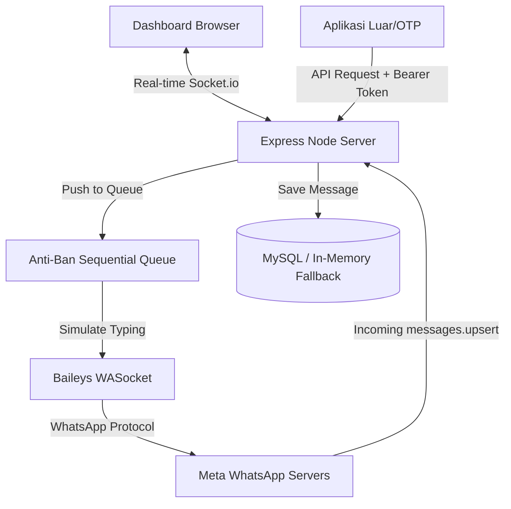

# Project Context & Architecture - HANDCAP WhatsApp Gateway

Dokumen ini berisi dokumentasi teknis menyeluruh tentang arsitektur, struktur direktori, alur data, variabel global, dan protokol keamanan proyek **HANDCAP WhatsApp Gateway**. Dokumen ini ditulis agar mudah dipahami oleh pemilik proyek (manusia) maupun asisten AI yang akan melanjutkan pengembangan proyek ini.

---

## 1. Identitas & Teknologi Utama
*   **Nama Project**: HANDCAP - Corporate WhatsApp Gateway Console
*   **Tujuan**: Gateway API mandiri (self-hosted) untuk mengirim pesan otomatis (OTP, notifikasi transaksi) dari sistem eksternal serta menyediakan konsol kampanye massal (broadcast) dan Live Chat terintegrasi.
*   **Tech Stack**:
    *   **Runtime**: Node.js (Express.js)
    *   **WhatsApp Engine**: `@whiskeysockets/baileys` (Pustaka Web WhatsApp berbasis WebSocket)
    *   **Real-time Communication**: `socket.io` (Sinkronisasi status dan progres secara real-time)
    *   **Database**: MySQL (dengan **In-Memory Fallback Registry** jika DB luring/mati)
    *   **Frontend**: Vanilla HTML5, CSS3 (Premium White & Blue palette), dan Vanilla JS (asynchronous partial loaders)

---

## 2. Struktur Direktori Utama

```text
HANDCAP/
├── sessions/               # Kredensial WhatsApp per sesi (kunci enkripsi, sesi Baileys)
├── src/
│   ├── db.js               # Manajemen DB (Postgres & Fallback Array)
│   ├── index.js            # Entry point utama (Server HTTP & WebSocket)
│   ├── sessionManager.js   # Lifecycle WhatsApp, Autoload Sesi, & Antrean Anti-Ban
│   ├── public/             # Folder aset statis (Frontend)
│   │   ├── index.html      # Kerangka utama dashboard
│   │   └── partials/       # Modul HTML yang dimuat secara dinamis
│   │       ├── sidebar.html      # Menu samping sticky
│   │       ├── overview.html     # Dasbor ringkasan statistik
│   │       ├── connections.html  # Pengelolaan link QR akun WA
│   │       ├── chat.html         # Konsol Live Chat (CRM style)
│   │       ├── broadcasts.html   # Konsol Kampanye Massal
│   │       ├── sandbox.html      # Fitur uji coba API manual
│   │       ├── docs.html         # API Endpoint Code Snippets
│   │       └── settings.html     # Pengaturan API Key & Database
│   └── routes/
│       └── api.js          # REST API Endpoints dengan proteksi Bearer Token
├── .env                    # Konfigurasi sistem & kredensial database
├── package.json            # Daftar dependensi & npm scripts
└── PROJECT_CONTEXT.md      # File ini (Dokumentasi Arsitektur)
```

---

## 3. Alur Kerja Komponen Utama (Core Architecture Flow)



---

## 4. Analisis Modul Kode (Core Modules)

### A. `src/db.js` (Database & Fallback Layer)
*   **Fungsi**: Bertanggung jawab menyimpan log pesan keluar, histori pesan Live Chat (`chat_messages`), dan log kampanye broadcast (`campaigns` & `campaign_recipients`).
*   **In-Memory Fallback**: Jika koneksi MySQL gagal, data akan dialihkan secara otomatis ke array memori:
    *   `memoryCampaigns`: Menyimpan metadata kampanye broadcast.
    *   `memoryRecipients`: Menyimpan status pengiriman tiap kontak tujuan kampanye.
    *   `memoryChatMessages`: Menyimpan histori chat masuk dan keluar.
*   **Metode Utama**:
    *   `saveChatMessage(sessionId, msgId, phone, message, fromMe)`: Menyimpan riwayat chat (dilengkapi `ON CONFLICT (msg_id) DO NOTHING` untuk mencegah duplikasi).
    *   `getChats(sessionId)`: Mengambil daftar kontak unik yang memiliki riwayat chat dengan sesi tertentu, diurutkan dari chat terbaru.
    *   `getChatMessages(sessionId, phone)`: Mengambil histori chat lengkap antara nomor Anda dengan kontak tertentu secara kronologis.

### B. `src/sessionManager.js` (WhatsApp Engine & Anti-Ban Queue)
*   **Fungsi**: Mengelola inisialisasi sesi (`initSession`), autentikasi multi-device, penutupan sesi (`deleteSession`), dan pemrosesan antrean pesan keluar.
*   **Variabel Global**:
    *   `sessions` (Map): Menyimpan status aktif perangkat WhatsApp. Kuncinya adalah `sessionId`. Isinya meliputi:
        *   `socket`: Objek koneksi Baileys WASocket.
        *   `status`: `'connecting' | 'connected' | 'qr' | 'disconnected'`.
        *   `qr`: String raw QR Code (jika belum terhubung).
        *   `queue` (Array): Antrean pesan keluar untuk sesi tersebut.
        *   `isProcessing` (Boolean): Flag penanda apakah pekerja antrean sedang aktif.
        *   `io`: Referensi Socket.io server untuk memancarkan update.
*   **Protokol Keamanan Anti-Ban**:
    1.  **Simulasi Mengetik**: Sebelum mengirim pesan, worker memanggil status `socket.sendPresenceUpdate('composing', recipient)`.
    2.  **Delay Ketikan**: Sistem menahan pengiriman selama jeda waktu acak **1,5 - 3 detik** untuk meniru kecepatan mengetik manusia.
    3.  **Pengiriman & Pause**: Pesan dikirim, lalu status mengetik dinonaktifkan (`paused`).
    4.  **Cool-down Delay**: Setelah pesan terkirim, jika masih ada antrean berikutnya, sistem akan tertidur (*sleep*) selama jeda waktu acak **3 - 6 detik** sebelum mengirim pesan selanjutnya agar tidak terdeteksi sebagai spam oleh Meta.
*   **Penyelesaian Duplikasi JID (LID vs PN)**:
    WhatsApp memigrasikan akun ke sistem **LID (Linked Identity)**. Akibatnya, balasan dari HP kadangkala masuk menggunakan ID unik `@lid` (seperti `169999117340830`).
    Sistem di `messages.upsert` mengantisipasi ini dengan mendeteksi properti `remoteJidAlt` (nomor telepon asli pengirim) jika tersedia:
    ```javascript
    const targetJid = msg.key.remoteJidAlt || msg.key.remoteJid;
    const phone = targetJid.split('@')[0];
    ```
    Hal ini memastikan seluruh pesan (baik PN maupun LID) selalu terpusat pada satu thread obrolan yang sama berdasarkan nomor asli pengirim.

### C. `src/routes/api.js` (REST API Gateway)
*   **Fungsi**: Menyediakan pintu gerbang terautentikasi untuk aplikasi luar menggunakan otentikasi **Bearer Token** (`Authorization: Bearer <API_KEY>`).
*   **Endpoints Utama**:
    *   `POST /api/v1/send-message`: Mengirimkan satu pesan WhatsApp (dimasukkan ke antrean Anti-Ban terlebih dahulu).
    *   `POST /api/v1/broadcasts`: Membuat dan menjalankan kampanye broadcast massal di latar belakang.
    *   `GET /api/v1/chats`: Mendapatkan riwayat daftar thread obrolan aktif.
    *   `GET /api/v1/chats/:phone/messages`: Mendapatkan pesan obrolan secara detail dengan nomor tertentu.

### D. `src/public/index.html` & Partials (Frontend Layout)
*   **Fungsi**: Dashboard interaktif yang mengontrol sistem.
*   **Variabel State di Browser**:
    *   `activeSessionsList` (Array): Daftar seluruh sesi terdaftar di server beserta status koneksinya.
    *   `activeChatPhone` (String): Nomor telepon kontak yang sedang dibuka pada Live Chat.
    *   `activeChatSession` (String): ID sesi pengirim yang saat ini aktif digunakan untuk Live Chat (default: `'default'`).
*   **Asynchronous Loader (`loadPartials`)**:
    Dashboard memuat file HTML partial secara dinamis untuk menghemat memori browser dan memudahkan pemeliharaan kode secara modular.

---

## 5. Konfigurasi Variabel Lingkungan (`.env`)

```ini
# Port Server Node.js
PORT=3001

# API Key unik untuk otentikasi Bearer Token API
API_KEY=supersecretapikey

# Konfigurasi Database MySQL (Opsional, otomatis fallback ke memori jika dikosongkan)
DB_HOST=localhost
DB_PORT=3306
DB_USER=root
DB_PASSWORD=
DB_NAME=handcap_db

# Folder penyimpanan sesi Baileys
SESSION_DIR=./sessions
```

---

## 6. Petunjuk Penting Bagi AI (Developer Instruction)
*   **Selalu Prioritaskan Anti-Ban Queue**: Jangan pernah mengirim pesan langsung tanpa melalui `sessionManager.sendMessage()` karena metode tersebut yang mengelola antrean jeda acak dan simulasi mengetik.
*   **Modifikasi Frontend**: Jika Anda mengubah tampilan layout pada halaman tertentu, edit file-file partial di dalam direktori `src/public/partials/` terlebih dahulu. `index.html` hanya berfungsi sebagai cangkang pemanggil (*shell layout*).
*   **Manajemen Database Fallback**: Bila ada penambahan tabel atau query baru di `db.js`, Anda **wajib** menulis fungsi fallback in-memory yang sepadan agar sistem dapat terus berjalan normal meskipun server MySQL tidak terpasang di komputer pengguna.
